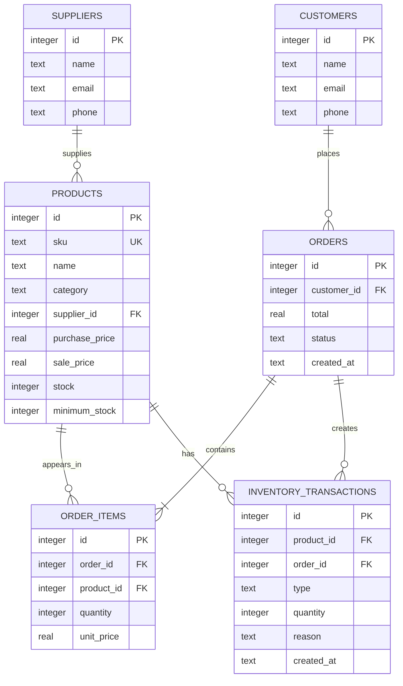

# Database schema

```mermaid
erDiagram
    SUPPLIERS ||--o{ PRODUCTS : supplies
    CUSTOMERS ||--o{ ORDERS : places
    ORDERS ||--|{ ORDER_ITEMS : contains
    PRODUCTS ||--o{ ORDER_ITEMS : appears_in
    PRODUCTS ||--o{ INVENTORY_TRANSACTIONS : has
    ORDERS ||--o{ INVENTORY_TRANSACTIONS : creates

    SUPPLIERS {
        integer id PK
        text name
        text email
        text phone
    }
    CUSTOMERS {
        integer id PK
        text name
        text email
        text phone
    }
    PRODUCTS {
        integer id PK
        text sku UK
        text name
        text category
        integer supplier_id FK
        real purchase_price
        real sale_price
        integer stock
        integer minimum_stock
    }
    ORDERS {
        integer id PK
        integer customer_id FK
        real total
        text status
        text created_at
    }
    ORDER_ITEMS {
        integer id PK
        integer order_id FK
        integer product_id FK
        integer quantity
        real unit_price
    }
    INVENTORY_TRANSACTIONS {
        integer id PK
        integer product_id FK
        integer order_id FK
        text type
        integer quantity
        text reason
        text created_at
    }
```
